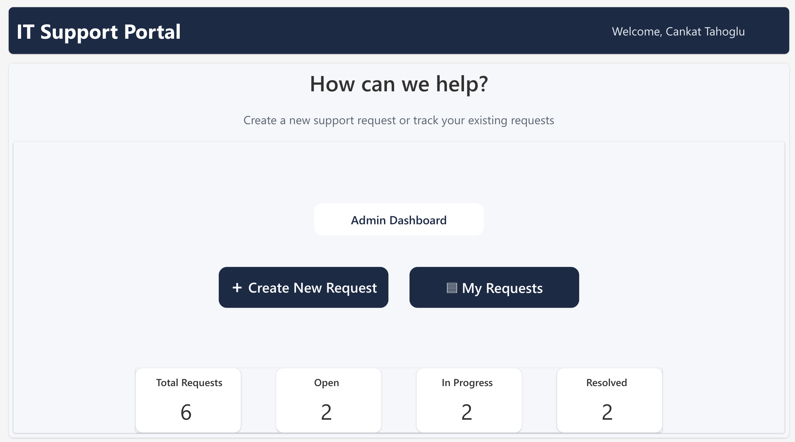
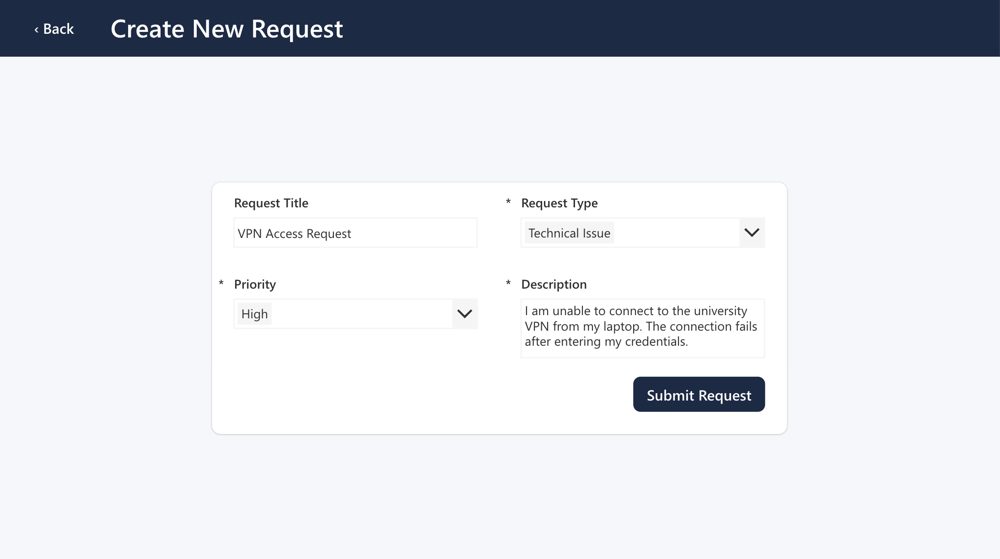
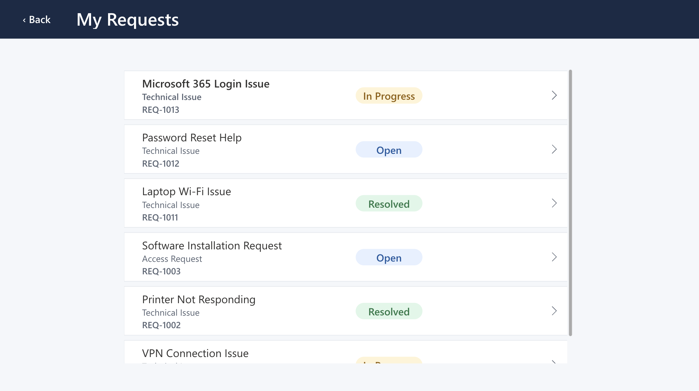
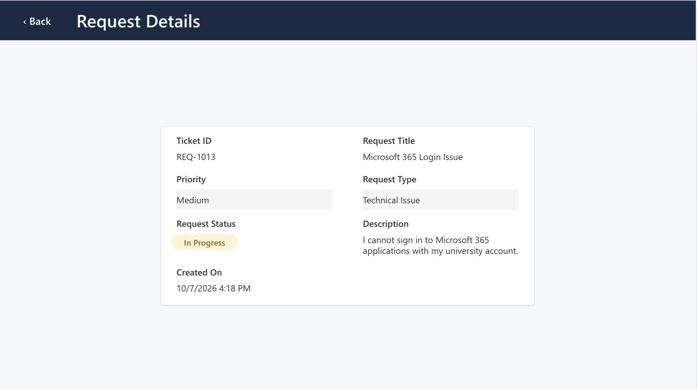
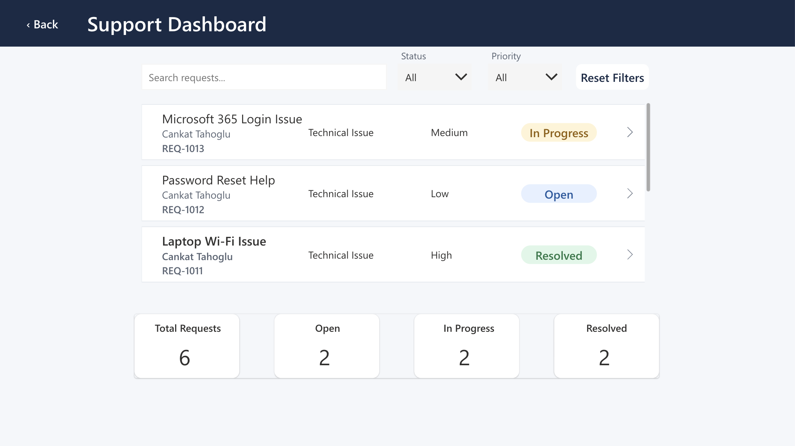
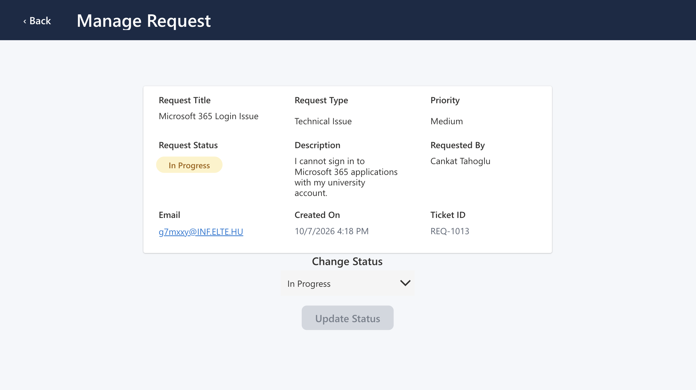
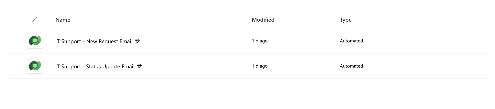
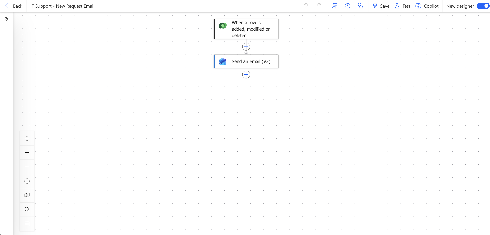

# IT Support Portal

A Microsoft Power Platform application for submitting, tracking, and managing internal IT support requests.

The project demonstrates an end-to-end support ticket workflow using **Power Apps**, **Microsoft Dataverse**, **Power Automate**, and **Power Fx**.

> This application was developed in a Microsoft Power Platform developer environment. The live application is tenant-restricted, so screenshots and workflow documentation are provided below for demonstration.

## Overview

IT Support Portal allows users to create support tickets and track their progress, while providing an admin-facing dashboard for managing requests and updating ticket statuses.

The application uses Dataverse as its data layer and Power Automate to send automated email notifications when requests are created or their status changes.

## Features

### User features

- Submit new IT support requests
- Select request type and priority
- Automatically generate unique ticket IDs such as `REQ-1013`
- View personal support requests
- Track ticket status:
  - Open
  - In Progress
  - Resolved
- View detailed ticket information
- Receive an automated confirmation email after submitting a request
- Receive automated email notifications when the ticket status changes

### Admin features

- View all support requests from a central dashboard
- Search requests by title, requester, type, or ticket ID
- Filter requests by status
- Filter requests by priority
- Reset active filters
- View dashboard statistics
- Open individual requests
- Change request status
- Prevent unnecessary status updates when the selected status has not changed

## Technology Stack

- **Microsoft Power Apps** — Canvas application and user interface
- **Microsoft Dataverse** — Persistent data storage
- **Power Automate** — Automated email workflows
- **Power Fx** — Application logic, filtering, navigation, and data operations
- **Office 365 Outlook** — Email delivery

## Application Workflow

```text
User
  │
  ▼
Power Apps
  │
  ├── Create Request
  ├── View My Requests
  └── View Request Details
  │
  ▼
Microsoft Dataverse
  │
  ├── Stores support requests
  ├── Generates ticket IDs
  └── Stores ticket status
  │
  ├──────────────► Power Automate
  │                 │
  │                 ├── New request confirmation
  │                 └── Status update notification
  │
  ▼
Admin Dashboard
  │
  ├── Search and filter requests
  ├── View request details
  └── Update ticket status
```

## Screenshots

### Home



### Create New Request



### My Requests



### Request Details



### Support Dashboard



### Manage Request



## Power Automate

Two automated workflows support the application.

### New Request Email

When a new support request is added to Dataverse, Power Automate sends a confirmation email containing the ticket information.



### Status Update Email

When the request status is changed, a second automated flow sends the requester an updated status notification.



## Data Model

The main Dataverse table is `IT Support Requests`.

Key fields include:

| Field | Purpose |
|---|---|
| Ticket ID | Automatically generated ticket identifier |
| Request Title | Short description of the issue |
| Request Type | Type of IT support request |
| Priority | Low, Medium, or High |
| Description | Detailed problem description |
| Request Status | Open, In Progress, or Resolved |
| Requested By | Requester name |
| Email | Requester email address |
| Created On | Request creation timestamp |

## What I Learned

This project helped me gain practical experience with:

- Building Canvas Apps in Microsoft Power Apps
- Designing and working with Dataverse tables
- Writing Power Fx formulas
- Creating search and filtering functionality
- Managing application state and navigation
- Building automated cloud flows with Power Automate
- Using Dataverse triggers
- Working with dynamic values in automated emails
- Designing user and administrator workflows
- Debugging Power Apps and Power Automate integrations

## Future Improvements

Potential future improvements include:

- Additional Dataverse security configuration for broader organizational deployment
- Responsive mobile layouts
- Request assignment to support agents
- Comments and ticket history
- SLA tracking
- Attachments
- Additional reporting and analytics

## Project Status

The core application workflow is complete and functional.

The application currently runs in a Microsoft Power Platform developer environment and is intended as a portfolio and learning project.
